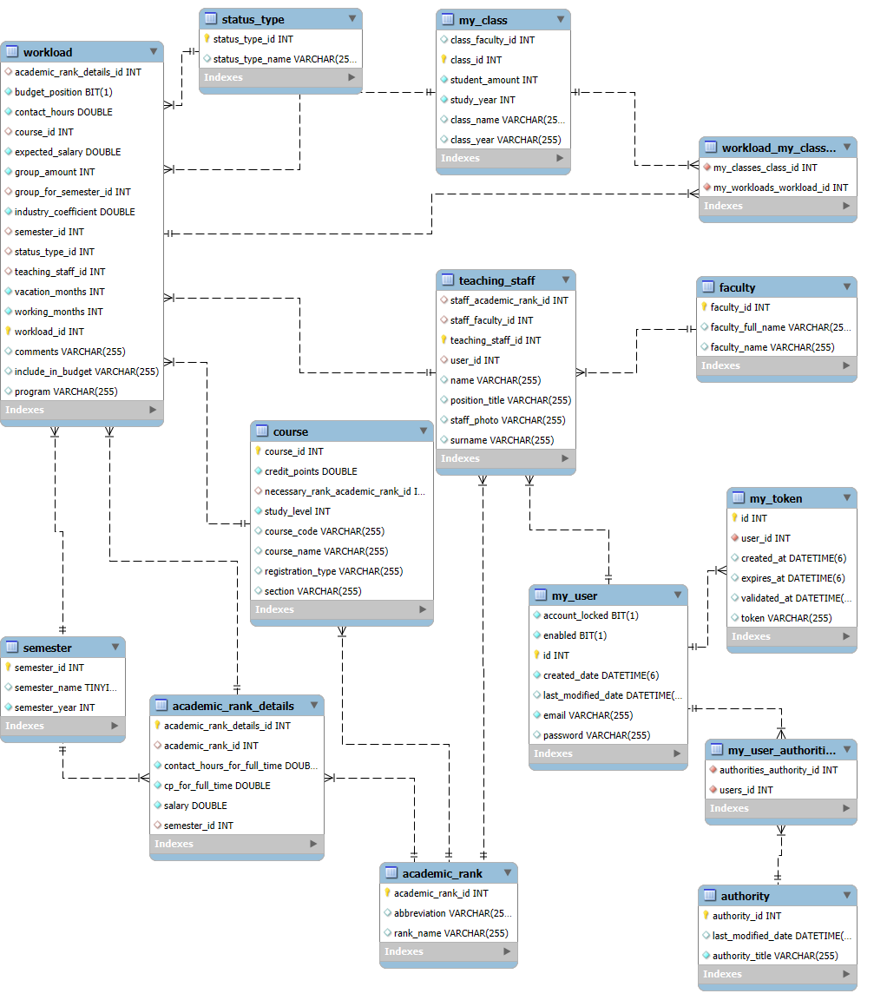

```sql
SELECT u.name as 'Vārds',
    u.surname as 'Uzvārds',
    CONCAT(u.name, ' ', u.surname) AS 'Vārds, Uzvārds',
    CONCAT(t.position_title, ' ', u.name, ' ', u.surname) AS 'Amats,Vārds, Uzvārds',
    aStaff.cp_for_autumn AS 'KP pilnai slodzei',
    w.cp_proportion_on_fulltime AS 'Slodzes daļa',
    t.position_title AS 'Amata nosaukums',
    aStaff.rank_name AS 'amata grupa',
    s.status_type_name AS 'statuss',
    w.include_in_budget AS 'Iekļaut budžetā',
    fstaff.faculty_name AS 'pasniedzēja fakultāte',
    w.semester AS 'semestris',
    co.course_name AS 'Priekšmeta nosaukums',
    w.credit_points_per_hour AS 'Progr. koef. KP/stundas',
    co.credit_points AS 'Priekšmeta kp',
    w.credit_points_per_group AS 'KP skaits grupai',
    w.group_amount AS 'grupu skaits',
    w.contact_hours AS 'Kontaktstundas',
    co.course_code AS 'LAIS kods',
    co.section AS 'Programmas daļa',
    co.registration_type AS 'Reģistrācija',
    fCourse.faculty_name AS 'Priekšmeta fakultāte',
    fClass.faculty_name AS 'kursa fakultāte',
    program AS 'Programma',
    co.study_level AS 'Studiju līmenis',
    w.group_for_semester AS 'Grupa semestra grafikam',
    -- grupa MANY TO MANY????
    GROUP_CONCAT(class.class_name SEPARATOR ', ') AS classes,
    w.comments AS 'Komentāri',
    w.budget_position AS 'budžeta pozīcija',
    GROUP_CONCAT(class.student_amount SEPARATOR ', ') AS 'Studentu skaits',
    aStaff.salary AS 'Alga',
    w.industry_coefficient AS 'Nozares koef.',
    w.salary_per_month AS 'Alga mēnesī',
    w.vacation_months AS 'Vai atvaļinājums ieskaitās',
    w.working_months AS 'Mēnešu skaits',
    w.expected_salary AS 'Algai paredzētais'
FROM workload AS w
JOIN teaching_staff AS t ON w.teaching_staff_id = t.teaching_staff_id
JOIN user AS u ON u.user_id = t.user_id
JOIN status_type AS s ON s.status_type_id = w.status_type_id
JOIN course AS co ON co.course_id = w.course_id
JOIN academic_rank AS aCourse ON aCourse.academic_rank_id = co.necessary_academic_rank_id
JOIN academic_rank AS aStaff ON aStaff.academic_rank_id = w.academic_rank_id
JOIN faculty AS fStaff ON fstaff.faculty_id = t.staff_faculty_id
JOIN faculty AS fCourse ON fCourse.faculty_id = co.necessary_academic_rank_id
JOIN workload_clases AS classId ON classId.workload_id = w.workload_id
JOIN academic_class AS class ON class.class_id = classId.class_id
JOIN faculty AS fClass ON fClass.faculty_id = class.class_faculty_id
GROUP BY
w.workload_id
```
